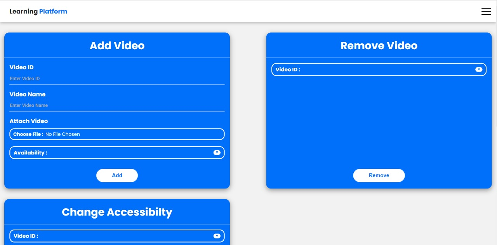

# Features
### As the user enters the website he is greeted with this landing page

## Videos
#### Students can view videos uploaded by instructors

## Announcements
#### Students can view and download attachments regarding announcements uploaded by instructors

## Q&A 
#### Students can ask questions, their colleagues or teachers can provide the answers
#### The teacher can manage the Q&A, if there is innapropriate or incorrect answers or question

## Assignments
#### Students can download assignment related attachments and submit their work to be graded and displayed on the website

#### Instructor can manage the assignments

## PDF editor
#### This facilitates the editing of the pdfs inside the site without the need to switch applications and save precious time

## Manage Users
#### The instructor can view and manage both assistants and users

